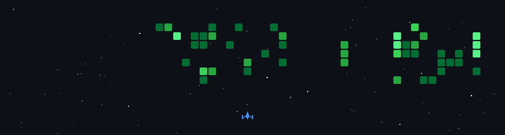

# 👋 Oi, eu sou o Lucas

*Building local-first software and on-device AI — everything runs on your machine, nothing goes to the cloud.*

Desenvolvedor autodidata do interior do Rio Grande do Sul 🇧🇷. Construo software
que **roda inteiro na sua máquina**: apps offline-first, IA local em hardware que
a maioria das pessoas nem sabe que tem, e material de estudo que explica o código
linha a linha, em português.

---

### 🔍 O que eu pesquiso e construo

- 🧠 **IA local / on-device** — modelos rodando na NPU e GPU do próprio notebook
  (Whisper + OpenVINO), sem depender de nuvem
- 📴 **Apps offline-first e portáteis** — desktop com Electron, PWAs com service
  worker, dados que ficam com o dono
- 📚 **Aprender em público** — cada projeto vira também material didático em
  pt-BR: conceitos explicados do zero, glossários, código comentado
- ⚙️ **Automação e ferramentas de dev** — GitHub Actions, pipelines de dados,
  scripts que resolvem problema real

### 🚀 Projetos em destaque

| Projeto | O que é |
|---|---|
| [**TranscritorNPU**](https://github.com/LucasCerattoRS/-TranscritorNPU) | Transcrição de áudio/vídeo 100% local com Whisper large-v3-turbo rodando na **NPU** via OpenVINO GenAI, interface Gradio. Nada sobe pra nuvem. |
| [**FinanWise**](https://github.com/LucasCerattoRS/finan) | 💰 Gestor de finanças pessoais offline e portátil (Electron) + 37 documentos didáticos explicando o código linha a linha. |
| [**Horizonte Estudos**](https://github.com/LucasCerattoRS/horizonte-estudos) | Painel de estudos PWA offline-first (ENEM/UFRGS) em vanilla JS — Cloudflare Pages/D1/Push e pipeline de dados de provas. |
| [**Sistema RH (estudo)**](https://github.com/LucasCerattoRS/Sistema_RH-Estudo-Publico) | Material didático sobre um monólito Node.js/Express/SQLite: 28 conceitos de web explicados do zero + glossário A–Z. |

### 🛠️ Stack

**Linguagens**

**Runtime, dados & IA local**

**Infra & automação**

### 📫 Contato

- 💼 LinkedIn: [lucas-ceratto](https://www.linkedin.com/in/lucas-ceratto-b404b439a/)

---

### 🕹️ GitHub Activity Game

Este space shooter é **gerado automaticamente a partir das minhas contribuições**
por uma GitHub Action — atualiza sozinho conforme minha atividade recente.

  

