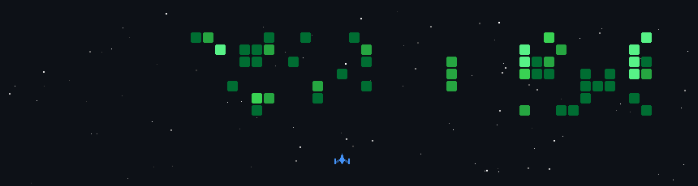

# 👋 Oi, eu sou o Lucas

*Local-first software, IA on-device, e a lógica do faça-você-mesmo aplicada a tudo.*

Desenvolvedor autodidata do interior do Rio Grande do Sul 🇧🇷. Construo software
que **roda inteiro na sua máquina**: apps offline-first, IA local em hardware que
a maioria das pessoas nem sabe que tem, e material de estudo que explica o código
linha a linha, em português.

Fora do teclado, faço engenharia reversa de projeto e programação completa de
máquinas CNC numa indústria moveleira: traduzo modelo 3D de designer em peça
real, ou remodelo do zero quando o projeto não é viável. É de lá que vem meu
instinto de sistemas: o que funciona no papel raramente é o que funciona na
prática, e isso vale tanto pra madeira quanto pra código. Prefiro entender como
algo funciona por baixo e construir eu mesmo a confiar de olhos fechados.

> 🔧 **Manutenção produtiva.** Meus repositórios são mantidos e usados de
> verdade, não só publicados. A prioridade agora é aprofundar o que já existe
> antes de abrir o próximo.

---

### 🔍 O que eu pesquiso e construo

- 🧠 **IA local / on-device:** modelos rodando na NPU e GPU do próprio notebook
  (Whisper + OpenVINO), sem depender de nuvem
- 📴 **Apps offline-first e portáteis:** desktop com Electron, PWAs com service
  worker, dados que ficam com o dono
- 🤝 **Agentes de IA trabalhando junto:** um protocolo pra Claude Code e Codex
  dividirem tarefas no mesmo repositório, com handoff escrito e revisão por commit
- 📚 **Aprender em público:** cada projeto vira também material didático em
  pt-BR, com conceitos explicados do zero, glossários e código comentado
- ⚙️ **Automação e ferramentas de dev:** GitHub Actions, pipelines de dados,
  scripts que resolvem problema real
- 🔐 **Criptografia e engenharia reversa:** entender como as coisas são
  protegidas (e como quebram) antes de confiar nelas

### 🧰 Onde dá pra ver isso na prática

- [**TranscritorNPU**](https://github.com/LucasCerattoRS/TranscritorNPU): transcrição de áudio e vídeo 100% local, com Whisper na NPU via OpenVINO; também tira texto de imagens (OCR) e de PDFs
- [**Horizonte Estudos**](https://github.com/LucasCerattoRS/horizonte-estudos): painel de estudos ENEM/UFRGS em JavaScript puro, offline-first, com sincronização entre dispositivos
- [**Finan**](https://github.com/LucasCerattoRS/finan): gestor de finanças pessoais offline e portátil (Electron) + 37 documentos que explicam o código linha a linha
- [**Sistema RH (estudo)**](https://github.com/LucasCerattoRS/Sistema_RH-Estudo-Publico): Node.js, Express e SQLite explicados do zero, com glossário A–Z
- [**The Farmer Was Replaced Lab**](https://github.com/LucasCerattoRS/the-farmer-was-replaced-lab): guias e 42 scripts comentados pra estudar automação dentro do jogo
- [**AI Coop**](https://github.com/LucasCerattoRS/ai-coop): o protocolo de cooperação entre agentes citado acima

### 🎓 Onde estudo

Alura (Escola de Tecnologia) pros fundamentos formais. O resto, que é a maior
parte, é autodidata: abrindo o próprio código antigo, lendo os manuais das
tecnologias que já uso, e conversando bastante com IA até o "porquê" fazer
sentido, não só o "como".

### 🛠️ Stack

**Linguagens**

**Runtime, dados & IA local**

**Infra & automação**

### 📫 Contato

---

### 🕹️ GitHub Activity Game

Este space shooter é **gerado automaticamente a partir das minhas contribuições**
por uma GitHub Action, e se atualiza sozinho conforme a minha atividade recente.

  

